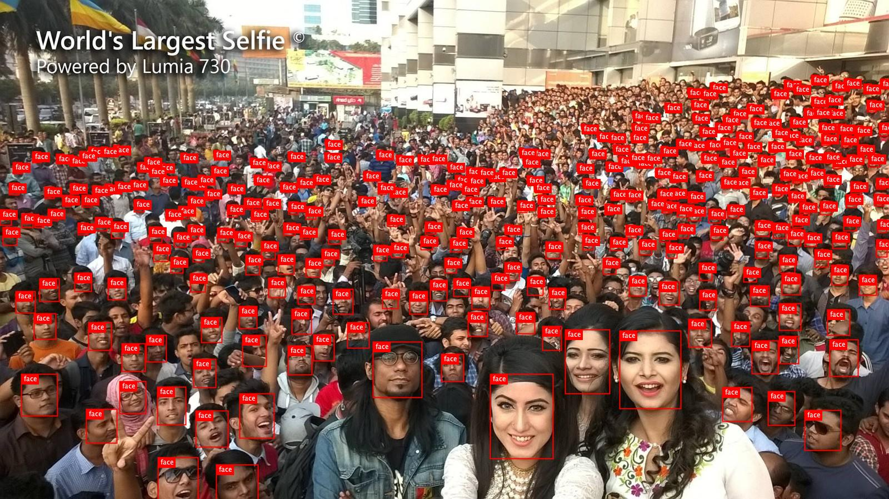

# SmartJavaAI：JAVA深度学习算法工具包





**SmartJavaAI**是基于 **DJL（Deep Java Library）** 封装的轻量级深度学习算法库，依托DJL的自动模型管理和跨框架特性，**无需安装Python环境**且无需手动下载模型文件（模型由DJL内部自动从云端加载），该库致力于构建Java生态与AI模型之间的高效桥梁。针对Java开发者面临的两大痛点：

- 🐍 主流AI框架（PyTorch/TensorFlow）的Python生态与Java工程体系割裂

- ⚙️ 直接使用DJL需处理模型加载、预处理、后处理等复杂技术细节

我们实现了：
✅ **开箱即用** - 两行代码完成人脸检测/识别  
✅ **多模型支持** - 集成RetinaFace/Ultra-Light-Fast-Generic-Face-Detector双检测模型（即将支持OCR/目标检测）  
✅ **跨平台兼容** - 完美支持Windows/Linux/macOS系统（x86 & ARM架构）  


## 🌟 核心优势
| 维度        | Python生态           | 原生DJL          | 本工具包         |
|------------|---------------------|-----------------|----------------|
| 开发效率    | 需搭建Python环境     | 需实现完整AI Pipeline | 提供即用API    |
| 学习成本    | 需掌握Python/C++混合编程 | 需深入理解AI框架机制 | Java语法即可调用 |
| 部署复杂度  | 需维护多语言服务      | 需处理底层资源调度 | 单一Jar包集成   |
| 性能表现    | 原生高性能           | 依赖开发者优化经验 | 内置生产级调优  |

## 📌 支持功能

### ✅ 已实现功能

- **人脸检测**  
  支持图片/视频流中的多面孔定位与质量评估

- **人脸特征提取**  
  基于深度学习算法生成512维特征向量

- **人脸特征比对** （1：1） 
  
- **人脸查询** （1：N） 
  人脸库注册/人脸库查询/人脸库删除

### ⌛ 规划中功能

- **OCR文字识别**  
  即将支持身份证/银行卡/车牌等关键信息提取，适配复杂背景与模糊文本

- **目标检测**  
  计划集成YOLOv9模型，支持车辆检测/安全帽识别/工业质检等场景

- **图像分割**  
  
- **语音识别**  
  基于Transformer的语音转文本引擎，支持中文/英文多语种识别


## 目前已集成的人脸算法模型

- **RetinaFace 模型**[[GitHub]](https://github.com/deepinsight/insightface/tree/master/detection/retinaface)：一个高效的深度学习人脸检测模型，支持高精度的人脸检测，但目前不支持人脸比对
- **Ultra-Light-Fast-Generic-Face-Detector-1MB ** [[GitHub\]](https://github.com/Linzaer/Ultra-Light-Fast-Generic-Face-Detector-1MB)：一个轻量级的人脸检测模型，适用于需要较低延迟和较小模型尺寸的应用场景。
- **Seetaface6**  [[GitHub\]](https://github.com/seetafaceengine/SeetaFace6)：是中科视拓最新开放的商业正式级版本，支持人脸检测、关键点定位、人脸识别。同时增加了活体检测、质量评估、年龄性别估计。并且响应时事，开放了口罩检测以及戴口罩的人脸识别模型

### 模型对比及下载地址

|         模型名称          |                           下载地址                           | 文件大小 |     适用场景      | 兼容系统            |
| :-----------------------: | :----------------------------------------------------------: | :------: | :---------------: | ------------------- |
|        retinaface         | [下载](https://resources.djl.ai/test-models/pytorch/retinaface.zip) |  110MB   |  高精度人脸检测   | Windows/Linux/MacOS |
| ultralightfastgenericface | [下载](https://resources.djl.ai/test-models/pytorch/ultranet.zip) |  1.7MB   |   高速人脸检测    | Windows/Linux       |
|        seetaface6         | [下载](https://pan.baidu.com/s/1hfNacA8ISV2qHrycjOkgqA?pwd=1234) |  288MB   | 人脸检测/人脸识别 | Windows/Linux       |

## 环境要求

- Java 版本：**JDK 11或更高版本**
- 操作系统：不同模型支持的系统不一样，具体请查看文档

## 使用步骤

> [!CAUTION]
>
> 📌 **运行提示**：
>
> （1）默认算法（RetinaFace）或轻量算法（Ultra-Light-Fast-Generic-Face-Detector ）都为python算法，兼容 Windows、Linux、MacOS，Android 等系统，SmartJavaAI首次启动将自动下载模型到及依赖库到本地（.djl.ai隐藏文件夹），建议保持网络畅通。初始化完成后，后续启动可实现毫秒级响应。在无网络环境下，可指定本地模型路径（需提前下载模型包）。目前，这两种算法不支持人脸识别或人脸比对功能。
>
> （2）Seetaface6 采用 C++ 编写，兼容 Windows、CentOS、Ubuntu 等系统。创建算法时，将自动加载对应系统的依赖库。Seetaface6 支持全功能人脸处理（人脸检测、人脸比对 1:1 或 1:N）。SmartJavaAI 通过 JNI 调用 C++ 接口，不支持在线下载模型，需手动下载并存储至本地。使用人脸比对等功能时，需要将项目中db/faces-data.db存放到您本地路径下并在config中指定人脸库路径。

### 1. 安装人脸算法依赖

在 Maven 项目的 `pom.xml` 中添加 SmartJavaAI的人脸算法依赖：

```xml
<dependencies>
     <dependency>
        <groupId>ink.numberone</groupId>
        <artifactId>smartjavaai-face</artifactId>
        <version>1.0.5</version>
     </dependency>
</dependencies>
```

### 2. 人脸检测代码示例

```java
//创建人脸算法
FaceAlgorithm currentAlgorithm = FaceAlgorithmFactory.createFaceAlgorithm();
//使用图片路径检测
FaceDetectedResult result = currentAlgorithm.detect("src/main/resources/largest_selfie.jpg");
```

### 3. 轻量人脸检测代码示例

```java
//创建人脸算法
FaceAlgorithm currentAlgorithm = FaceAlgorithmFactory.createLightFaceAlgorithm();
//使用图片路径检测
FaceDetectedResult result = currentAlgorithm.detect("src/main/resources/largest_selfie.jpg");
```

### 4. 使用图片输入流检测

```java
//支持各种输入流方式检测图片
File input = new File("src/main/resources/largest_selfie.jpg");
FaceDetectedResult result = currentAlgorithm.detect(new FileInputStream(input));
```

### 5. 人脸比对（1：1）

> [!CAUTION]
>
> （1）将项目中db/faces-data.db存放到您本地路径下
>
> （2）下载模型到本地路径，下载地址：https://pan.baidu.com/s/1hfNacA8ISV2qHrycjOkgqA?pwd=1234 提取码：1234
>
> （3）如果网盘地址请联系本人，文档最后有联系方式

```java
// 初始化配置
ModelConfig config = new ModelConfig();
config.setAlgorithmName("seetaface6");//目前支持人脸比对的算法只有：seetaface6
//人脸库路径 如果不指定人脸库，无法使用 1:N人脸搜索
config.setFaceDbPath("C:/Users/Administrator/Downloads/faces-data.db");
//改为模型存放路径
config.setModelPath("/opt/sf3.0_models");
//创建人脸算法
FaceAlgorithm currentAlgorithm = FaceAlgorithmFactory.createFaceAlgorithm(config);
//自动裁剪人脸并比对人脸特征
float similar = currentAlgorithm.featureComparison("src/main/resources/kana1.jpg","src/main/resources/kana2.jpg");
log.info("相似度：{}", similar);
```


### 6. 人脸特征提取及比对

```java
// 初始化配置
ModelConfig config = new ModelConfig();
config.setAlgorithmName("seetaface6");
//人脸库路径 如果不指定人脸库，无法使用 1:N人脸搜索
config.setFaceDbPath("C:/Users/Administrator/Downloads/faces-data.db");
//改为模型存放路径
config.setModelPath("C:/Users/Administrator/Downloads/sf3.0_models/sf3.0_models");
//创建人脸算法
FaceAlgorithm currentAlgorithm = FaceAlgorithmFactory.createFaceAlgorithm(config);
//提取图像中最大人脸的特征
float[] feature1 = currentAlgorithm.featureExtraction("src/main/resources/kana1.jpg");
float[] feature2 = currentAlgorithm.featureExtraction("src/main/resources/kana2.jpg");
float similar = currentAlgorithm.calculSimilar(feature1, feature2);
log.info("相似度：{}", similar);
```

### 7. 注册及搜索人脸（1：N）

```java
// 初始化配置
ModelConfig config = new ModelConfig();
config.setAlgorithmName("seetaface6");
//人脸库路径 如果不指定人脸库，无法使用 1:N人脸搜索
config.setFaceDbPath("C:/Users/Administrator/Downloads/faces-data.db");
//改为模型存放路径
config.setModelPath("C:/Users/Administrator/Downloads/sf3.0_models/sf3.0_models");
//创建人脸算法 自动将人脸库加载到内存中
FaceAlgorithm currentAlgorithm = FaceAlgorithmFactory.createFaceAlgorithm(config);
//等待人脸库加载完毕
Thread.sleep(1000);
//注册kana1人脸，参数key建议设置为人名
boolean isSuccss = currentAlgorithm.register("kana1","src/main/resources/kana1.jpg");
//注册jsy人脸，参数key建议设置为人名
isSuccss = currentAlgorithm.register("jsy","src/main/resources/jsy.jpg");
FaceResult faceResult = currentAlgorithm.search("src/main/resources/kana2.jpg");
if(faceResult != null){
    log.info("查询到人脸：{}", faceResult.toString());
}else{
    log.info("未查询到人脸");
}
```

### 8. 人脸检测（离线下载模型）

```java
// 初始化配置
ModelConfig config = new ModelConfig();
config.setAlgorithmName("retinaface");//人脸算法模型，目前支持：retinaface/ultralightfastgenericface/seetaface6
//config.setAlgorithmName("ultralightfastgenericface");//轻量模型
config.setConfidenceThreshold(FaceConfig.DEFAULT_CONFIDENCE_THRESHOLD);//置信度阈值
config.setMaxFaceCount(FaceConfig.MAX_FACE_LIMIT);//每张特征图保留的最大候选框数量
//nms阈值:控制重叠框的合并程度,取值越低，合并越多重叠框（减少误检但可能漏检）；取值越高，保留更多框（增加检出但可能引入冗余）
config.setNmsThresh(FaceConfig.NMS_THRESHOLD);
//模型下载地址：
//retinaface: https://resources.djl.ai/test-models/pytorch/retinaface.zip
//ultralightfastgenericface: https://resources.djl.ai/test-models/pytorch/ultranet.zip
//改为模型存放路径
config.setModelPath("/Users/xxx/Documents/develop/face_model/retinaface.pt");
//创建人脸算法
FaceAlgorithm currentAlgorithm = FaceAlgorithmFactory.createFaceAlgorithm(config);
//使用图片路径检测
FaceDetectedResult result = currentAlgorithm.detect("src/main/resources/largest_selfie.jpg");
logger.info("人脸检测结果：{}", JSONObject.toJSONString(result));
//使用图片流检测
File input = new File("src/main/resources/largest_selfie.jpg");
//FaceDetectedResult result = currentAlgorithm.detect(new FileInputStream(input));
//logger.info("人脸检测结果：{}", JSONObject.toJSONString(result));
BufferedImage image = ImageIO.read(input);
//创建保存路径
Path imagePath = Paths.get("output").resolve("retinaface_detected.jpg");
//绘制人脸框
ImageUtils.drawBoundingBoxes(image, result, imagePath.toAbsolutePath().toString());
```

## 完整代码

`📁 examples/src/main/java/smartai/examples/face`  
└── 📄[FaceDemo.java](https://github.com/geekwenjie/SmartJavaAI/blob/master/examples/src/main/java/smartai/examples/face/FaceDemo.java)  <sub>*（基于JDK11构建的完整可执行示例）*</sub>


## 🙏 鸣谢

本项目在开发过程中借鉴或使用了以下优秀开源项目，特此致谢：

- **[Seetaface6JNI](https://gitee.com/cnsugar/seetaface6JNI)**
---


## 联系方式

如果您有任何问题或建议，欢迎联系：

- **微信**: deng775747758 （请备注：SmartJavaAI）
- **Email**: 775747758@qq.com
